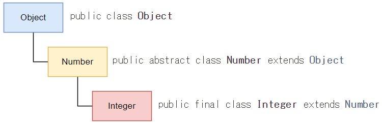

# Javaの型
## プリミティブ型
値を保持するのみの型\
メソッドはないです
メモリ上に直接その値が保持されます(ByValue:値渡し)\
継承はできません
```
int i = 10;
i.toString(); というものはない    
```

## オブジェクト型
java.lang.Objectを継承したクラス\
メモリ上に直接その値が保持されるのではなく、値を保持したメモリアドレスへの参照値が格納されます(ByReference:参照渡し)\
ただ他の言語とちょっと違いJavaは参照渡しではなく参照の値渡しと呼ばれるややこしい動作をします\
そのためあまり複雑に考えると訳が分からなくなるので注意

### StringSamples.javaで見てみよう

\
\
ところで継承ってなに？

## 継承
以下のようにextendsで基底クラスのメソッドやフィールドを引き継ぎ新しいクラスを作成すること\
基底クラスをスーパークラス、継承先をサブクラスと呼びます
```java
/**
 * BaseClassがスーパークラス
 * ClassSampleがサブクラス
 */
public class ClassSample extends BaseClass {
    
}
```

プリミティブ以外はこのObjectクラスを継承しています\
継承したサブクラスはObjectクラスに実装されているメソッドを使用することができる
```java
// 基底クラス
public class Object { 
    // コンストラクタ
    public Object(){}
    
    //　メソッド
    boolean equals(Object obj){}
    String toString(){}
    //....etc
}
```
サブクラスの例: Integerクラス

Integerクラスとは\
java.lang.Object -> java.lang.Number -> java.lang.Integer と継承されています\
ObjectのサブクラスがNumber, さらにサブクラスがInteger\
IntegerのスーパークラスがNUmber, さらにそのスーパークラスがObject\
という関係になります。\
\
ですので、以下のようなことになります
- プリミティブ型: int.toString() はない
- オブジェクト型を継承: Integer.toString() はある

### ExtendSample.javaを見てみよう


# ジェネリクスとは
一般的には以下のようにクラスを利用してメソッドを呼び出します
```java
public class SomeClass {
    public void method(Integer value){
        // .... 何かしらの処理をする
    }
}

public class Sample {
    public void UseSomeClassMethod() {
        // クラスを変数に代入
        SomeClass someClass = new SomeClass();
        
        // methodを呼び出し
        someClass.method("100");
    }
}
```

ところが、このメソッドはInteger型しか使えません。\
もっと汎用性のあるものにしたいというときはどうすればいいでしょうか？\
つまり、IntegerやLong, Doubleも使いたいとしたら？\
ひとつの方法はObjectを引数にするということです
```java
public class SomeClass {
    // 引数をObjectにしてみた
    public void method(Object value){
    }
}

public class Sample {
    public void UseSomeClassMethod() {
        // クラスを変数に代入
        SomeClass someClass = new SomeClass();

        // methodを呼び出し
        someClass.method(100);      // int
        someClass.method(30000L);   // long
        someClass.method(3.14F);    // float
        someClass.method(1.2345D);  // double
        // これもできてしまう
        someClass.method(new int[2]);
        someClass.method("あいうえお");
    }
}
```
ところがこれだと、文字列でも他のクラスでも配列でもなんでも引数として使えることになります。\
これは良くないので、クラスを生成する際に何かしらの型を指定して使えるようにできないか？\
ということで、できたのが汎用型<T>です (TではなくてもEでもRでも文字はなんでも可)\
これをジェネリクス型と呼びます\
ジェネリクス型というのは定義するときには型は決まっていないけれども、実際にコードを実行する際に型を決定する手法ということになります。
```java
/**
 * @param <T> ジェネリクス型
 */
public class SomeClass<T> {
    public void method(T value) {
    }


    public void UseSomeClassMethod() {
        // Integerを使用するクラスとして生成する
        SomeClass<Integer> someClassInt = new SomeClass<>();
        someClassInt.method(100);
        
        // Doubleを使用するクラスとして生成する
        SomeClass<Double> someClassDouble = new SomeClass<>();
        someClassDouble.method(1.2345D);
    }
}
```

さらにこのジェネリック型を使用し、特定のサブクラスやスーパークラスに限定するようにしたのが上限付きワイルドカード、下限付きワイルドカードです\
上限付きワイルドカード<? extends T> \
下限付きワイルドカード<? super T> \

### WildCardsSample.javaを見てみよう

## 匿名クラス
ジェネリック型のさらなる利用方法として匿名クラスがあります\
これはインタフェースに1つだけのメソッドを作成し、それを継承したクラスを作成せずに使えるようにしたものです\
ちなみに1つだけのメソッドを持つインタフェースを関数型インタフェースと言います\
そうであることを明記するために @FunctionalInterface をつけることもできます

### GenericSample.javaを見てみよう

## 既存の関数型インタフェース
```
    Consumer<T>
        accept(T value)
    Supplier<T>
        T get()
    Predicate<T>
        boolean test(T value)
    FUnction<T, R>    
        R apply(T value)
    
    ....Java Goldになると覚えるのが増えます💦
```
これらは既存の様々なメソッドで使用されていますが、たとえばsystem.out.println()はConsumerを呼び出しています\
Streamの中間処理でもそれらが利用されていたりします


## メソッド参照


## ラムダ構文


## Stream